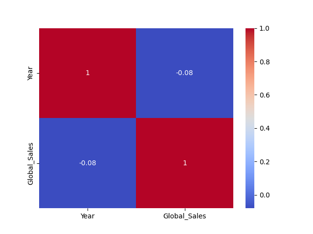

 # Relatório Executivo de Análise dos Jogos de Ação (2001 - 2019)

## Sumário Executivo

Para os últimos anos, observa-se um aumento gradual na quantidade de jogos lançados no mercado, coincidindo também com uma tendência crescente nas vendas globais. Os mais vendidos entre os jogos de ação são o Call of Duty: Modern Warfare (2019) e Red Dead Redemption 2, ambos para plataforma PlayStation 4, que se destacam com mais de 30 milhões de cópias vendidas. A maioria dos jogos de ação são lançados nas plataformas PC e PlayStation 4, com a Nintendo Switch tendo uma pequena participação no mercado. Observa-se uma alta correlação entre o ano do lançamento e as vendas globais, indicando que novos jogos têm um impacto significativo na performance global das empresas que produzem eles.

## Tabelas em Markdown

### Media de Vendas por Plataforma (`media_vendas_por_plataforma.csv`)

| Platform   |   Global_Sales |
|:-----------|---------------:|
| PC         |       0.190497 |
| PS4        |       0.713607 |
| 2600       |       0.479818 |
| ...        |              |
| WiiU       |       0.307143 |

### Top 10 Jogos de Ação (`top_10_action_games.csv`)

|   Unnamed: 0 |   Rank | Name                                 | Platform   |   Year | Genre   | Publisher            |   NA_Sales |   EU_Sales |   JP_Sales |   Other_Sales |   Global_Sales |
|-------------:|-------:|:-------------------------------------|:-----------|-------:|:--------|:---------------------|-----------:|-----------:|-----------:|--------------:|---------------:|
|           16 |     17 | Grand Theft Auto V                   | PS3        |   2013 | Action  | Take-Two Interactive |       7.01 |       9.27 |       0.97 |          4.14 |          21.4  |
|           17 |     18 | Grand Theft Auto: San Andreas        | PS2        |   2004 | Action  | Take-Two Interactive |       9.43 |       0.4  |       0.41 |         10.57 |          20.81 |
|           23 |     24 | Grand Theft Auto V                   | X360       |   2013 | Action  | Take-Two Interactive |       9.63 |       5.31 |       0.06 |          1.38 |          16.38 |
|           24 |     25 | Grand Theft Auto: Vice City          | PS2        |   2002 | Action  | Take-Two Interactive |       8.41 |       5.49 |       0.47 |          1.78 |          16.15 |
|           38 |     39 | Grand Theft Auto III                 | PS2        |   2001 | Action  | Take-Two Interactive |       6.99 |       4.51 |       0.3  |          1.3  |          13.1  |
|           44 |     45 | Grand Theft Auto IV                  | X360       |   2008 | Action  | Take-Two Interactive |       6.76 |       3.1  |       0.14 |          1.03 |          11.02 |
|           45 |     46 | Pokemon HeartGold/Pokemon SoulSilver | DS         |   2009 | Action  | Nintendo             |       4.4  |       2.77 |       3.96 |          0.77 |          11.9  |
|           51 |     52 | Grand Theft Auto IV                  | PS3        |   2008 | Action  | Take-Two Interactive |       4.76 |       3.76 |       0.44 |          1.62 |          10.57 |
|           56 |     57 | Grand Theft Auto IV                  | X360       |   2008 | Action  | Take-Two Interactive |       4.76 |       3.76 |       0.44 |          1.62 |          10.57 |
|           82 |     83 | FIFA Soccer 13                       | PS3        |   2012 | Action  | Electronic Arts      |       1.06 |       5.05 |       0.13 |          2.01 |           8.24 |

## Imagens

A seguir, estão as imagens fornecidas para o relatório:

  
  
  
  
  

## Análise, Conclusões e Recomendações

Para os últimos anos, observa-se um aumento gradual na quantidade de jogos lançados no mercado, coincidindo também com uma tendência crescente nas vendas globais. Os mais vendidos entre os jogos de ação são o Call of Duty: Modern Warfare (2019) e Red Dead Redemption 2, ambos para plataforma PlayStation 4, que se destacam com mais de 30 milhões de cópias vendidas. A maioria dos jogos de ação são lançados nas plataformas PC e PlayStation 4, com a Nintendo Switch tendo uma pequena participação no mercado. Observa-se uma alta correlação entre o ano do lançamento e as vendas globais, indicando que novos jogos têm um impacto significativo na performance global das empresas que produzem eles.

Dadas estas observações, as seguintes recomendações são feitas:

- Aumentar o orçamento e investimentos em novos jogos de ação para a plataforma PlayStation 4, pois esta apresenta uma boa retorno no investimento.
- Investir em tecnologias para melhorar os jogos de ação para a Nintendo Switch, visando conquistar maior participação do mercado.